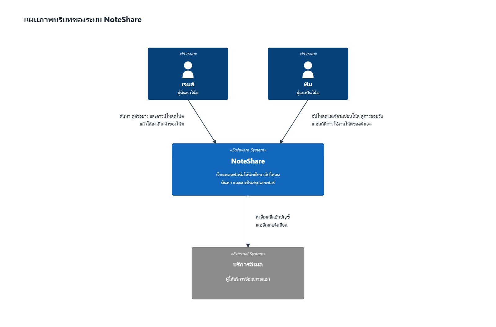
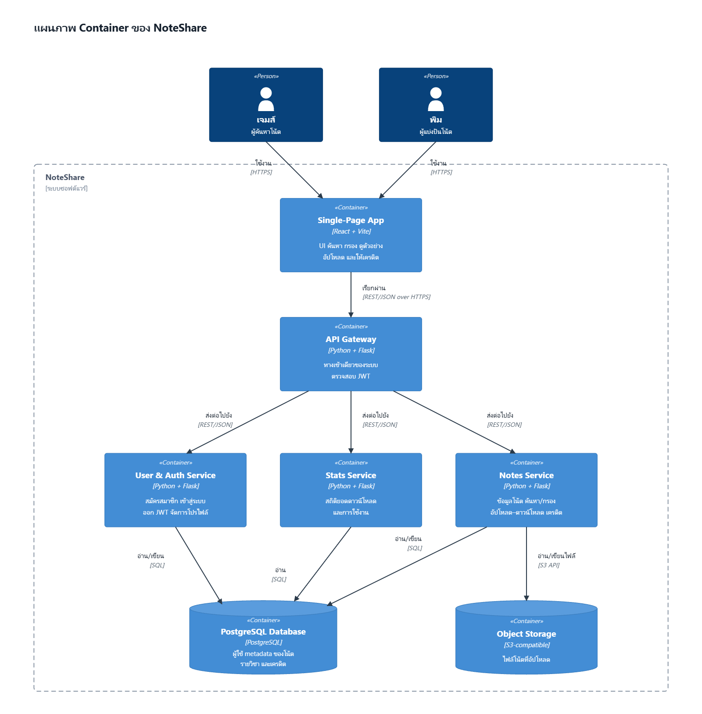

# NoteShare — สถาปัตยกรรม

🌐 [English](./README.md) · **ภาษาไทย**

พิมพ์เขียวทางสถาปัตยกรรมของ **NoteShare** เว็บแพลตฟอร์มให้นักศึกษาอัปโหลด ค้นหา และแบ่งปันสรุปเลกเชอร์
เราอธิบายระบบด้วย [C4 model](https://c4model.com/) (Level 1 และ 2) และบันทึกเหตุผลของการตัดสินใจสำคัญไว้เป็น [ADR](./adr/)

## C4 Level 1 — บริบทของระบบ (System Context)

ภาพรวมว่าใครใช้ NoteShare และระบบไปพึ่งพาบริการภายนอกอะไรบ้าง

| ความสัมพันธ์ | คำอธิบาย |
| --- | --- |
| เจมส์ (ผู้ค้นหาโน้ต) → NoteShare | ค้นหา ดูตัวอย่าง และดาวน์โหลดโน้ต แล้วให้เครดิตเจ้าของโน้ต |
| พิม (ผู้แบ่งปันโน้ต) → NoteShare | อัปโหลดและจัดระเบียบโน้ต ดูการยอมรับ/สถิติการใช้งานโน้ตของตัวเอง |
| NoteShare → บริการอีเมล | ส่งอีเมลยืนยันบัญชีและอีเมลแจ้งเตือน |

ต้นฉบับแผนภาพ: [`diagrams/c4-level-1-context.th.svg`](diagrams/c4-level-1-context.th.svg) · ดูคำอธิบายเพิ่มเติมที่ [c4-context.md](./c4-context.md)

## C4 Level 2 — Container

ซูมเข้าไปในระบบ NoteShare เพื่อดูส่วนประกอบที่ deploy แยกกันได้ และการสื่อสารระหว่างกัน

| Container | เทคโนโลยี | หน้าที่ |
| --- | --- | --- |
| Single-Page App | React + Vite | UI ทั้งหมดในเบราว์เซอร์: ค้นหา กรอง ดูตัวอย่าง อัปโหลด และให้เครดิต |
| API Gateway | Python + Flask | ทางเข้าเดียวของระบบ กระจาย request ไปยัง service และตรวจสอบ token (JWT) |
| User & Auth Service | Python + Flask | สมัครสมาชิก เข้าสู่ระบบ (เก็บรหัสผ่านแบบ hash) ออก JWT และจัดการโปรไฟล์ |
| Notes Service | Python + Flask | ข้อมูลโน้ต ค้นหา/กรอง จัดการอัปโหลด–ดาวน์โหลด และเครดิต |
| Stats Service | Python + Flask | รวมสถิติยอดดาวน์โหลดและการใช้งานโน้ต เพื่อการยอมรับของผู้แบ่งปัน |
| PostgreSQL Database | PostgreSQL | เก็บข้อมูลผู้ใช้ metadata ของโน้ต รายวิชา และเครดิต |
| Object Storage | S3-compatible | เก็บไฟล์โน้ตที่อัปโหลด (PDF/รูปภาพ) |

การเรียกทั้งหมดจาก SPA ผ่าน API Gateway ไปยัง service เป็น REST/JSON over HTTP (ดู [ADR-002](./adr/0002-use-restful-api-internal-communication.th.md)) ส่วน service แต่ละตัวคุยกับ PostgreSQL ด้วย SQL ตรง ๆ และ Notes Service เป็น container เดียวที่ต่อกับ Object Storage

ต้นฉบับแผนภาพ: [`diagrams/c4-level-2-container.th.svg`](diagrams/c4-level-2-container.th.svg) · ดูคำอธิบายเพิ่มเติมที่ [c4-container.md](./c4-container.md)

## Technology Stack

| ส่วน | ที่เลือกใช้ |
| --- | --- |
| Frontend | React (SPA) + Vite |
| Backend | Python + Flask (microservices) |
| Inter-service communication | REST / JSON over HTTP |
| Database | PostgreSQL |
| File storage | S3-compatible object storage |
| Packaging | Docker + Docker Compose |
| Deployment | backend รันเป็น container บน cloud host, frontend บน Vercel |

เหตุผลของแต่ละ layer และทางเลือกอื่นที่ชั่งใจดูที่ [tech_stack.md](./tech_stack.md) ส่วน trade-off ทั้งหมดอยู่ใน [ADR-001: Core Technology Stack](./adr/0001-tech-stack-selection.th.md)

## Architecture Decision Records

- [ADR-001 — การเลือก Core Technology Stack](./adr/0001-tech-stack-selection.th.md)
- [ADR-002 — ใช้ RESTful API สำหรับการสื่อสารระหว่าง Service](./adr/0002-use-restful-api-internal-communication.th.md)
- [ADR-003 — จำกัดขอบเขตของ slice แรกที่รันได้ ให้เหลือ service เดียวและเก็บไฟล์บนดิสก์](./adr/0003-tracer-bullet-scope.th.md)

> ⚠️ C4 Container diagram ด้านบนอธิบายสถาปัตยกรรม **เป้าหมาย** สิ่งที่ `docker compose up` ยกขึ้นมาจริงตอนนี้แคบกว่านั้น — มีแค่ `notes-service` กับ `stats-service` ยังไม่มี gateway และยังไม่มี auth ดูรายละเอียดใน ADR-003

## แก้ไขแผนภาพ

แผนภาพแต่ละรูปเก็บไว้สองรูปแบบในโฟลเดอร์ `diagrams/` และมีทั้งฉบับอังกฤษกับฉบับไทย

- `*.mmd` — ต้นฉบับแบบข้อความของ Mermaid (Level 1 ใช้ `C4Context`, Level 2 ใช้ `C4Container`) รีวิวเป็น diff ใน PR ได้ และฝังไว้ใน [c4-context.md](./c4-context.md) กับ [c4-container.md](./c4-container.md) ด้วย
- `*.svg` — รูปเนื้อหาเดียวกันที่จัดตำแหน่งเอง ส่วนไฟล์ `.png` ข้างกันคือรูปที่ export ไปแสดงใน README

ถ้าจะแก้แผนภาพ ให้แก้ **ทั้งสองรูปแบบ** ให้ตรงกัน แล้ว export `.png` ใหม่ที่ความกว้าง 1600px (เปิด SVG ในเบราว์เซอร์แล้ว export หรือใช้เครื่องมือแปลง SVG เป็น PNG อะไรก็ได้) ใช้ชื่อไฟล์เดิม ทั้งสองภาษาใช้พิกัดชุดเดียวกัน ถ้าขยับ layout ที่ภาษาหนึ่งก็ก๊อปไปใช้อีกภาษาได้ตรง ๆ

รูปที่แสดงมาจาก SVG ไม่ใช่ผลลัพธ์จาก Mermaid เพราะ renderer ของ `C4Container` วางป้ายชื่อขอบเขตระบบทับกับป้ายกำกับเส้น และไม่สนใจค่าจำนวนกล่องต่อแถว ทำให้ Level 2 อ่านไม่ออก ส่วน Level 1 ป้ายกำกับเส้นที่มีข้อความเต็มก็เบียดกันด้วยเหตุผลเดียวกัน — ตัวต้นฉบับ Mermaid เอง parse ผ่านปกติ (ตรวจด้วย `mermaid-cli` แล้ว) ดูรายละเอียดที่ [c4-container.md](./c4-container.md)
