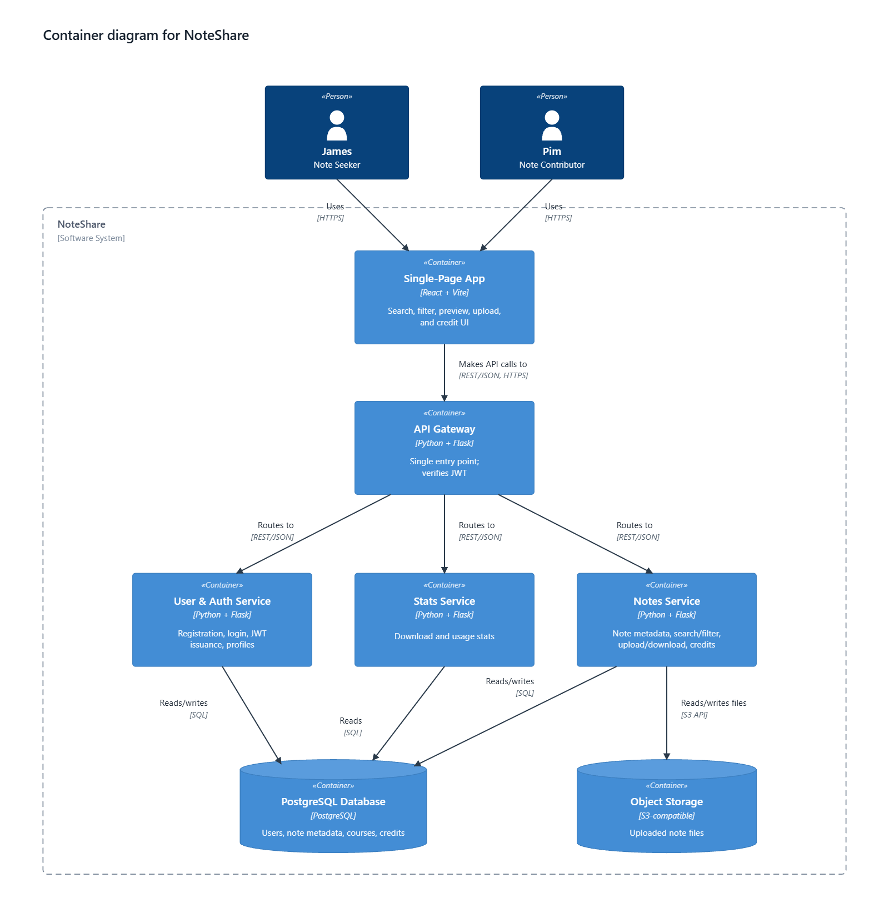
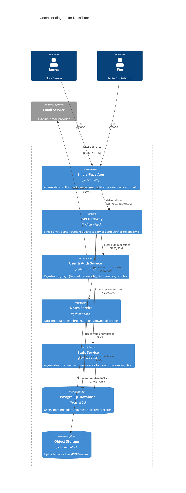

# C4 Level 2 — Containers (Diagram Source)

แผนภาพ C4 Level 2 (Container) ของ NoteShare — container, เทคโนโลยี และ responsibility ทั้งหมดตรงกับตารางใน [README.md](./README.md#c4-level-2--containers) ทุกประการ

แผนภาพนี้มีสองต้นฉบับที่เก็บเนื้อหาเดียวกัน

- **Mermaid** — [`diagrams/c4-level-2-container.mmd`](diagrams/c4-level-2-container.mmd) (ฉบับไทย: [`.th.mmd`](diagrams/c4-level-2-container.th.mmd)) ใช้ `C4Container` ตามมาตรฐาน C4
- **SVG** — [`diagrams/c4-level-2-container.svg`](diagrams/c4-level-2-container.svg) (ฉบับไทย: [`.th.svg`](diagrams/c4-level-2-container.th.svg)) เป็นรูปที่จัดตำแหน่งเองแล้ว ใช้เป็นรูปที่แสดงใน README

แก้ที่ไหนต้องแก้ให้ตรงกันทั้งสองที่ ขั้นตอน export `.png` อยู่ใน [README.md](./README.md#editing-the-diagrams)

## Diagram

## Mermaid source

## Containers (อ้างอิงจาก README.md)

| Container | Tech | Responsibility |
| --- | --- | --- |
| Single-Page App | React + Vite | All user-facing UI in the browser: search, filter, preview, upload, credit |
| API Gateway | Python + Flask | Single entry point; routes requests to services and verifies tokens (JWT) |
| User & Auth Service | Python + Flask | Registration, login (hashed passwords), JWT issuance, profiles |
| Notes Service | Python + Flask | Note metadata, search/filter, upload/download, credits |
| Stats Service | Python + Flask | Aggregates download and usage stats for contributor recognition |
| PostgreSQL Database | PostgreSQL | Users, note metadata, courses, and credit records |
| Object Storage | S3-compatible | Uploaded note files (PDF/images) |

การเรียกทั้งหมดระหว่าง SPA → API Gateway → services เป็น REST/JSON over HTTP (รายละเอียดใน [ADR-002](./adr/0002-use-restful-api-internal-communication.md)) ส่วน service แต่ละตัวคุยกับ PostgreSQL ด้วย SQL ตรง ๆ และ Notes Service เป็นตัวที่ต่อกับ Object Storage สำหรับไฟล์โน้ตที่อัปโหลด/ดาวน์โหลด

## ทำไมรูปที่แสดงเป็น SVG ไม่ใช่ผลลัพธ์จาก Mermaid

ต้นฉบับ Mermaid ข้างบนใช้ `C4Container` ตามมาตรฐานและ parse ผ่าน (ตรวจด้วย `mermaid-cli` แล้ว) แต่รูปที่ renderer พ่นออกมาอ่านยาก เพราะ renderer ของ `C4Container` มีปัญหา 2 ข้อที่แก้จากในไฟล์ต้นฉบับไม่ได้ (ลองแล้วด้วยแผนภาพเปล่าที่มีแค่ 2 container ก็ยังเจอเหมือนกัน)

1. **ป้ายชื่อขอบเขตระบบทับกับป้ายกำกับเส้น** — ข้อความ `NoteShare [Software System]` ถูกวางที่ตำแหน่งคงที่เหนือกรอบ ซึ่งเป็นจุดเดียวกับที่เส้นจากเจมส์และพิมพาดผ่าน
2. **container เรียงได้ประมาณ 2 ตัวต่อแถวเท่านั้น** — ค่า `$c4ShapeInRow` ไม่มีผล เพราะ renderer คิดความกว้างจาก `screen.availWidth` ของเบราว์เซอร์ตอน render ไม่ใช่จากค่าใน config ทำให้ 3 service ที่ต่อจาก API Gateway ถูกเรียงเป็นแถวตั้ง แล้วเส้นตัดกันไปมา

จึงเก็บไว้ทั้งสองอย่าง — Mermaid เป็น text source ที่ diff ได้และตรงตามที่ใบงานกำหนด ส่วน SVG ที่วาดเองเป็นรูปที่คุมตำแหน่งได้และใช้แสดงใน README โดยยังใช้สัญลักษณ์ตามมาตรฐาน C4 ครบ: กล่อง `«Person»` / `«Container»`, ชื่อ + `[เทคโนโลยี]` + หน้าที่ในทุกกล่อง, รูปทรงกระบอกสำหรับที่เก็บข้อมูล, กรอบเส้นประของขอบเขตระบบ และเส้นความสัมพันธ์ที่มีทั้งคำอธิบายและโพรโทคอล
