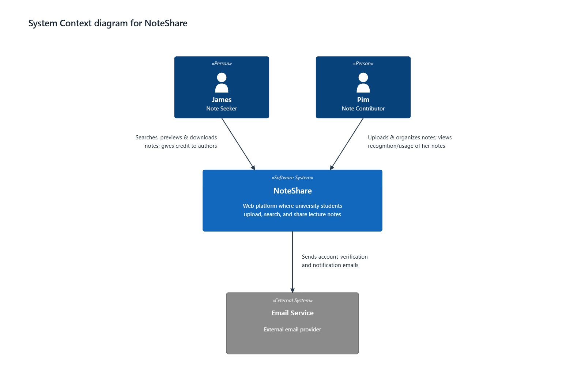
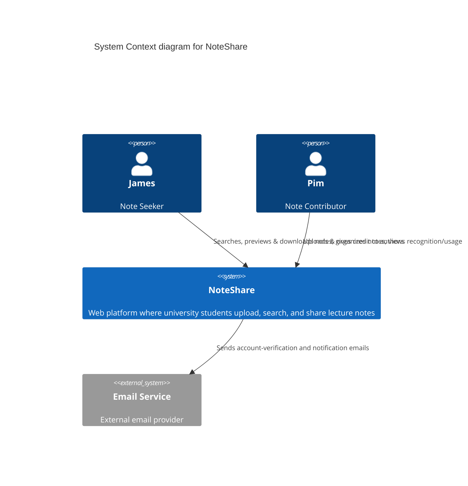

# C4 Level 1 — System Context (Diagram Source)

แผนภาพ C4 Level 1 (System Context) ของ NoteShare

แผนภาพนี้มีสองต้นฉบับที่เก็บเนื้อหาเดียวกัน

- **Mermaid** — [`diagrams/c4-level-1-context.mmd`](diagrams/c4-level-1-context.mmd) (ฉบับไทย: [`.th.mmd`](diagrams/c4-level-1-context.th.mmd)) เป็น text source ที่ diff และรีวิวใน PR ได้
- **SVG** — [`diagrams/c4-level-1-context.svg`](diagrams/c4-level-1-context.svg) (ฉบับไทย: [`.th.svg`](diagrams/c4-level-1-context.th.svg)) เป็นรูปที่จัดตำแหน่งเองแล้ว ใช้เป็นรูปที่แสดงใน README

แก้ที่ไหนต้องแก้ให้ตรงกันทั้งสองที่ ขั้นตอน export `.png` อยู่ใน [README.md](./README.md#editing-the-diagrams)

## Diagram

## Mermaid source

## Relationships

| Relationship | Description |
| --- | --- |
| James (Note Seeker) → NoteShare | Searches, previews & downloads notes; gives credit to authors |
| Pim (Note Contributor) → NoteShare | Uploads & organizes notes; views recognition/usage of her notes |
| NoteShare → Email Service | Sends account-verification and notification emails |

ตารางนี้ตรงกับป้ายกำกับเส้นทั้งใน Mermaid source และในรูป SVG ทุกคำ

## ทำไมมีทั้ง Mermaid และ SVG

Mermaid เป็นต้นฉบับแบบข้อความตามที่ใบงานกำหนด ข้อดีคือแก้ทีละบรรทัดแล้วเห็น diff ใน PR ได้ แต่ตอน render จริงป้ายกำกับเส้นของ Level 1 ที่มีข้อความเต็มจะเบียดกัน เพราะ renderer วางป้ายที่จุดกลางเส้นโดยไม่หลบกัน จึงวาด SVG ขึ้นมาอีกชุดเพื่อคุมตำแหน่งเอง และใช้รูปนั้นเป็นรูปที่แสดงใน README (เหตุผลของ Level 2 หนักกว่านี้ ดู [c4-container.md](./c4-container.md))

สัญลักษณ์ที่ใช้เป็นไปตามมาตรฐาน C4 ทั้งสองต้นฉบับ: กล่อง `«Person»` สำหรับผู้ใช้, `«Software System»` สีน้ำเงินสำหรับระบบที่พิจารณา, `«External System»` สีเทาสำหรับระบบภายนอก และเส้นความสัมพันธ์ที่มีคำอธิบายกำกับ ส่วนรายละเอียดเทคโนโลยีและโพรโทคอลอยู่ที่ Level 2 ตามที่ C4 model กำหนดว่าเป็นเรื่องของ container diagram
