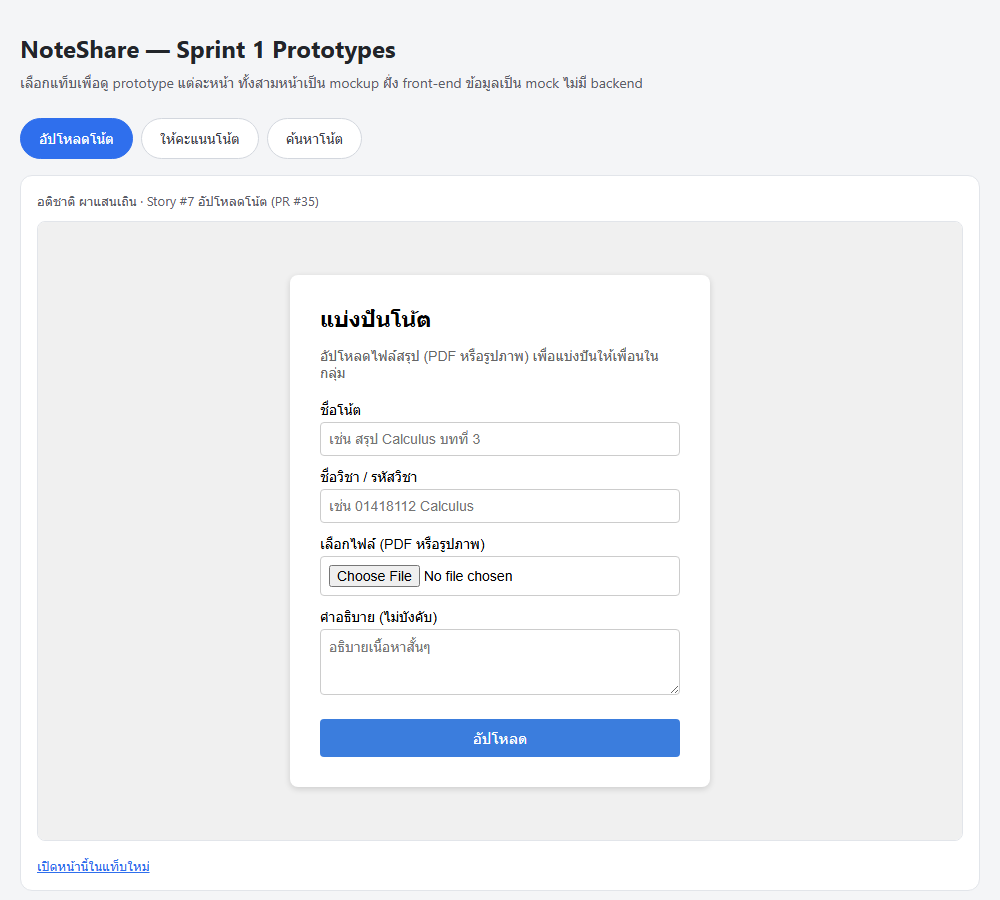
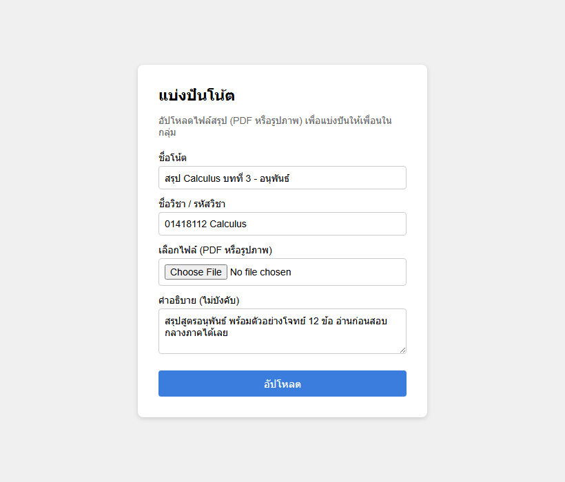
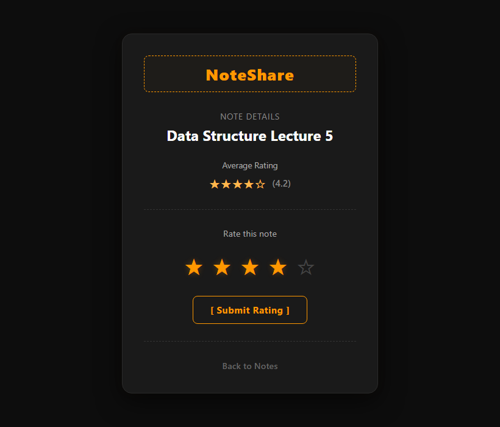
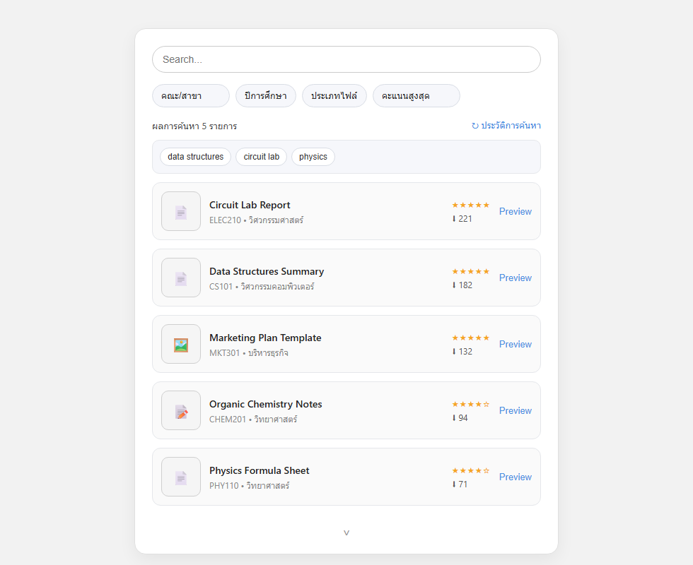

# Sprint 1 Prototypes

โฟลเดอร์นี้เก็บ interactive prototype 3 หน้าที่ทำใน Sprint 1 สำหรับ Lab 4 โดยแต่ละคนในทีมรับผิดชอบหนึ่ง flow เริ่มดูได้จาก `index.html` ซึ่งเป็นหน้าหลักที่รวมทั้งสามหน้าไว้ในที่เดียว

## Prototype ไม่ใช่ Tracer Bullet

งานชิ้นนี้คือ **Prototype** ไม่ใช่ **Tracer Bullet** ทั้งสามหน้าเป็น front-end mockup ล้วน ๆ — HTML/CSS + vanilla JS ที่รันในเบราว์เซอร์ตรง ๆ ไม่มี backend จริงรองรับอยู่เบื้องหลัง ข้อมูลที่เห็น (รายการโน้ต, คะแนนเฉลี่ย, ผลค้นหา) เป็น mock/hardcoded อยู่ใน JS ทั้งหมด ไม่มีการเรียก API จริง

เหตุผลที่ยังทำ Tracer Bullet ไม่ได้: ตามที่ระบุใน [ADR-001](../../docs/architecture/adr/0001-tech-stack-selection.th.md) สถาปัตยกรรมที่วางไว้เป็น microservices หลายตัว (API Gateway, User & Auth, Notes, Stats) พร้อม PostgreSQL และ object storage แต่ตอนนี้มีแค่ `services/stats-service/` ที่เป็น scaffold เปล่า ๆ ส่วน service อื่นและฐานข้อมูลยังไม่ถูกสร้างขึ้นจริง Tracer Bullet ต้องเป็น slice บาง ๆ ที่วิ่งจริงผ่าน service ต่าง ๆ แบบ end-to-end ซึ่งยังทำไม่ได้ในสถานะปัจจุบันของโปรเจกต์ เป้าหมายของรอบนี้จึงเป็นการ validate UI/UX flow ก่อน ไม่ใช่ validate สถาปัตยกรรมจริง

## ขอบเขต (Scope)

| ไฟล์ | ผู้ทำ | แสดงอะไร |
| --- | --- | --- |
| `index.html` | อติชาติ | หน้าหลักรวม prototype ทั้งสาม — คลิกแท็บเพื่อสลับหน้าที่แสดงใน iframe (เริ่มที่หน้าอัปโหลดโน้ต) |
| `atichat_upload_note_prototype.html` | อติชาติ (PR #35) | flow อัปโหลดโน้ต — form กรอกชื่อโน้ต/วิชา, เลือกไฟล์ PDF หรือรูปภาพ, คำอธิบาย, validate ฝั่ง client (กรอกครบ + ชนิดไฟล์ถูกต้อง) ก่อนแจ้งว่า "อัปโหลดสำเร็จ" |
| `kittamet_note_rating_prototype.html` | กฤตเมธ (PR #36) | หน้ารายละเอียดโน้ต + ให้คะแนนแบบดาว (1-5) คลิกเลือกดาวแล้วกด submit เพื่อดู alert ยืนยัน |
| `wachirawit_search_note_prototype.html` | วชิรวิทย์ (PR #37) | หน้าค้นหาโน้ต — ค้นหาด้วยคำ, filter ตามคณะ/ปีการศึกษา/ประเภทไฟล์, sort (ล่าสุด/คะแนน/ยอดดาวน์โหลด), และ panel ประวัติการค้นหา |

**นอกขอบเขต (out of scope) ของรอบนี้:**
- ไม่มีระบบ auth จริง (ไม่มี login/session ใด ๆ)
- ไม่มีการอัปโหลด/เก็บไฟล์จริง — หน้าอัปโหลดแค่ validate แล้วแจ้งผลจำลอง ไม่มีไฟล์ถูกส่งไปไหน
- ข้อมูลโน้ต/คะแนนเฉลี่ยเป็นค่า hardcoded ในโค้ด ไม่มี state คงอยู่ข้าม reload (ยกเว้นประวัติการค้นหาของหน้า search ที่เก็บใน `localStorage` ของเบราว์เซอร์ เพื่อ demo UX เฉย ๆ ไม่ใช่ persistence ระดับ backend)

## หลักฐานภาพ

PR #35, #36, #37 ที่ merge ไปแล้วไม่มี screenshot แนบไว้ตอนรีวิว (แก้ย้อนหลังใน PR ที่ merge แล้วไม่ได้) จึงถ่าย screenshot ของ prototype ที่รันจริงย้อนหลังไว้ใน `screenshots/` แทน ทุกภาพถ่ายจากไฟล์ในโฟลเดอร์นี้ตามที่ commit ไว้ ไม่ได้แก้โค้ดเพื่อถ่ายภาพ — สถานะบนหน้าจอ (ค่าในฟอร์ม, ดาวที่เลือก, ประวัติการค้นหา) เซ็ตผ่าน DOM/event จริงก่อนกดชัตเตอร์

**หน้าหลักรวม prototype — `index.html`**

**อัปโหลดโน้ต (อติชาติ)** — กรอกฟอร์มครบก่อนกดอัปโหลด

**ให้คะแนนโน้ต (กฤตเมธ)** — คลิกเลือก 4 ดาว ดาวเปลี่ยนสถานะแล้ว

**ค้นหาโน้ต (วชิรวิทย์)** — เรียงตามคะแนนสูงสุด + เปิด panel ประวัติการค้นหา

wireframe ตอนออกแบบยังเก็บไว้ในโฟลเดอร์เดียวกัน (`atichat_upload_note_wireframe.svg`, `kittamet_note_rating_wireframe.png`, `wachirawit_search_wireframe.png`) เทียบกับ screenshot ด้านบนได้ว่าของที่ทำออกมาตรงกับที่ร่างไว้แค่ไหน

## วิธีรัน

ไม่ต้อง build หรือรัน server ใด ๆ เปิด `index.html` ตรง ๆ ในเบราว์เซอร์ได้เลย (ดับเบิลคลิก หรือ `start index.html` จาก terminal) แล้วคลิกแท็บเพื่อสลับดูแต่ละหน้า หรือจะเปิดไฟล์ `*_prototype.html` แยกทีละหน้าก็ได้ แต่ละไฟล์โหลด CSS ของตัวเองจากไฟล์ข้าง ๆ ในโฟลเดอร์เดียวกันอัตโนมัติ

## Next step (Sprint 2)

flow ทั้งสามผ่านการดูร่วมกันในทีมแล้วว่าลำดับหน้าจอเข้าท่า ขั้นต่อไปคือเลิกใช้ mock แล้วต่อของจริง เรียงตามลำดับที่ตั้งใจจะทำ:

1. **ยกหน้าอัปโหลดขึ้นเป็น Tracer Bullet ตัวแรก** — ทำ Notes service + PostgreSQL + object storage ให้พอวิ่งได้ 1 slice บาง ๆ (เลือกไฟล์ → ผ่าน API Gateway → เก็บไฟล์ + เขียน metadata → เห็นในรายการ) เลือก flow นี้ก่อนเพราะกินทุกชั้นของสถาปัตยกรรมใน [ADR-001](../../docs/architecture/adr/0001-tech-stack-selection.th.md) จึงพิสูจน์สถาปัตยกรรมได้คุ้มที่สุดต่อหนึ่งหน้า
2. **ต่อหน้าค้นหาเข้ากับข้อมูลจริง** — เปลี่ยน mock array เป็น query จาก Notes service แล้วย้าย filter/sort ไปทำฝั่ง server
3. **ต่อหน้าให้คะแนนเข้ากับ Stats service** — คะแนนเฉลี่ยต้องคำนวณจากคะแนนที่ผู้ใช้ให้จริง และกันการให้คะแนนซ้ำ ซึ่งต้องมี auth ก่อน
4. **เปลี่ยน `alert()` เป็น feedback ในหน้า** — ทั้งสามหน้าใช้ `alert()` เพราะเร็วและพอสำหรับ prototype แต่ของจริงต้องเป็น inline error/toast ที่บอกได้ว่าผิดตรงไหน

ตัว markup/CSS ของสามหน้านี้ตั้งใจให้เป็นของทิ้งได้ ถ้าตอน Sprint 2 พบว่าโครง UI ไม่เข้ากับข้อมูลจริง จะเขียนใหม่แทนการดัด ไม่ถือว่าเสียของเพราะเป้าหมายของรอบนี้คือได้คำตอบเรื่อง flow ไม่ใช่ได้โค้ดที่ต้องรักษาไว้
